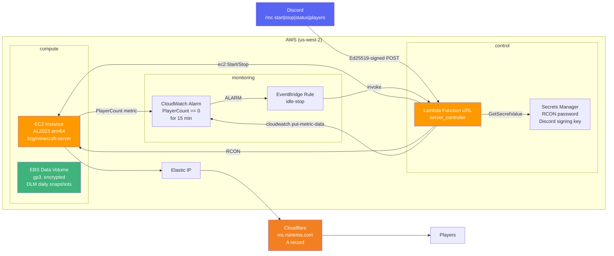

# mc-server-iac

Infrastructure-as-Code for a shared Minecraft server on AWS EC2, controlled via Discord.

## Overview

`mc-server-iac` deploys a Minecraft server on a single `t4g.large` EC2 instance (Amazon Linux 2023, arm64) with an Elastic IP and Cloudflare DNS record (`mc.rsinema.com`). The server is started and stopped on demand via Discord slash commands — spun up when friends want to play, stopped automatically when idle for 15 minutes.

## Architecture



## How Friends Connect

1. Install Minecraft and connect to `mc.rsinema.com:25565`.
2. Your username must be on the server whitelist (see [runbook](./docs/runbook.md)).
3. Use `/mc start` in Discord to spin up the server.
4. The server stops itself 15 minutes after the last player disconnects.

## Quickstart

### Prerequisites

- [OpenTofu](https://opentofu.org/) ≥ 1.8
- AWS CLI configured with credentials for the target account
- `CLOUDFLARE_API_TOKEN` env var (for DNS management)
- Discord application with public key, bot token, and application ID

### Deploy

```bash
git clone https://github.com/rsinema/mc-server-iac.git
cd mc-server-iac

# Set required env vars
export CLOUDFLARE_API_TOKEN=<your-token>

# Optional: override defaults via terraform.tfvars (not committed)
echo 'discord_webhook_url = "https://discord.com/api/webhooks/..."' > terraform.tfvars

tofu init
tofu validate
tofu plan
tofu apply
```

### Post-deploy Setup

1. **Set the Discord public key** in Secrets Manager:
   ```bash
   aws secretsmanager update-secret \
     --secret-id MCServerInstance-discord-signing-key \
     --secret-string '{"public_key":"<hex-from-discord-developer-portal>"}'
   ```
2. **Register the Lambda Function URL** as a webhook in your Discord application.
3. **Add Discord bot** to your server and create a `/mc` slash command pointing to the Function URL.

See [docs/runbook.md](./docs/runbook.md) for full post-deploy steps.

## Cost Estimate

| Resource | Monthly Cost (est.) |
|---|---|
| EC2 `t4g.large` (stopped = no charge) | ~$0 if stopped most of the month |
| EBS `gp3` 10 GB | ~$1.10 |
| Lambda invocations (start/stop/idle-check) | ~$0.05 |
| CloudWatch metrics + alarm | ~$0.10 |
| EIP (always allocated) | ~$3.65 |
| Cloudflare DNS | $0 |
| **Total (idle)** | **~$4.90/mo** |
| **Total (running full-time)** | **~$53/mo** |

Running 2×/week for ~4 hours per session ≈ 32 hours/month → **~$7/mo** (EC2 + fixed costs).

## Documentation

| File | Purpose |
|---|---|
| [PLAN.md](./PLAN.md) | Single source of truth for the revival effort |
| [CLAUDE.md](./CLAUDE.md) | AI session context: conventions, commands, boundaries |
| [AGENTS.md](./AGENTS.md) | Rules for coding agents |
| [docs/runbook.md](./docs/runbook.md) | Ops procedures |

## License

MIT
